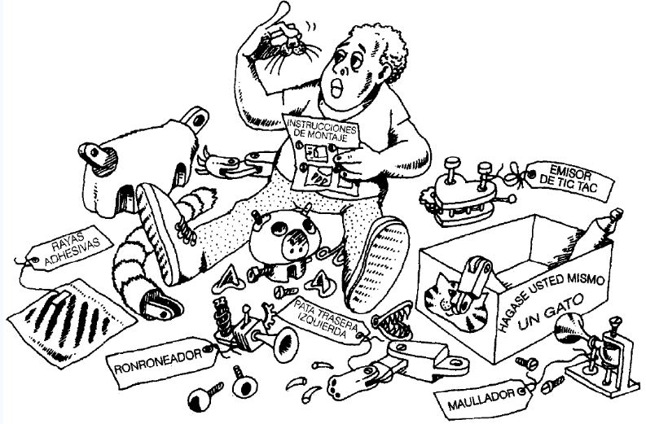

# 👋 UTN - FRP - TUP - Programación 2 - 2025

--

## Programación II - 2025- Documentos, ejemplos y guía de ejercicios 

<em>
Ilustración sobre el significado de la propiedad de modularidad de la POO. 
Observe el detalle de que el niño revisa las 
especificaciones para realizar el ensamble.
Fuente: Booch Grady. Análisis y diseño orientado a objetos 
</em>

## Enlaces
[Documentos y guías de ejercicios](https://docs.google.com/document/d/1hyqf2vUc-L7eqAjOI93UfZTTYKlHMh-mJ3IsVtmffGY/preview)

---

## ⚠️ Disclaimer

Todo el contenido publicado en este perfil de GitHub, incluyendo repositorios públicos, es proporcionado con fines educativos y/o de desarrollo.

No me hago responsable por el uso indebido, ilegal o malicioso del código por parte de terceros, ya sea mediante forks, clones o redistribuciones. Cada usuario es responsable de cómo utiliza el código publicado.

Mis proyectos no representan necesariamente la opinión ni están vinculados a ninguna organización con la que colabore o haya colaborado.

---

¡Gracias por visitar mi perfil!
